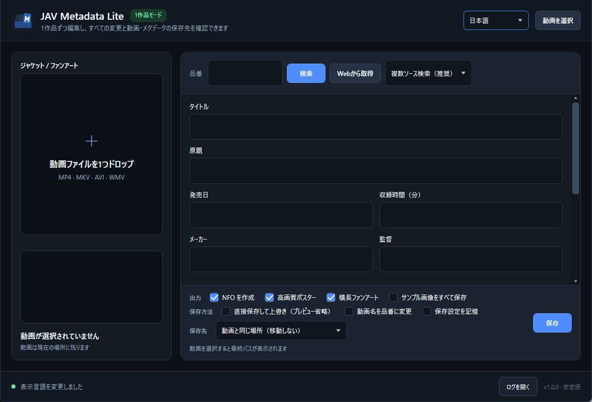

# JavMetaLite


[简体中文](README.zh-Hans.md) · [繁體中文](README.zh-Hant.md) · [English](README.md) · **日本語**

[](https://github.com/Noredge/JavMetaLite/actions/workflows/ci.yml)

1本の動画を個別に整理する、Windows向けの軽量メタデータエディターです。動画を選択またはドロップし、情報を検索して各項目を確認・編集した後、保存前にすべてのファイル変更をプレビューできます。JavMetaLiteはメディアライブラリ全体をスキャンせず、ユーザーの確認前に動画を書き換えたり移動したりしません。



## 主な機能

- 選択した1本の動画だけを処理し、一括取得やメディアライブラリのスキャンは行いません。
- LibreDMMから日本語情報、R18.devから英語情報を取得し、JAVLibraryを手動ブラウザーの予備取得元として利用できます。
- 複数ソース検索後、項目ごとに取得元を選択でき、引き続き手動編集もできます。
- ローカルのNFO、poster、fanartを読み込み、安全に更新しながら未知のXMLを保持します。
- Jellyfin互換のNFO、poster、fanart、および任意の`extrafanart/`を生成します。
- 動画を元の場所に残す、同じ場所に品番フォルダーを作る、または指定した保存先ルートへ整理することができます。
- 別ドライブやUNC保存先では、安全なコピーとSHA-256検証を行い、失敗時には元の状態へ戻します。
- 保存前に実際の変更内容を標準で表示し、保存先に別の動画がある場合は必ず処理を停止します。
- .NET Runtimeの追加インストールが不要な、自己完結型Windows x64ポータブル実行ファイルです。

## クイックスタート

1. [GitHub Releases](https://github.com/Noredge/JavMetaLite/releases)から`JavMetaLite-v1.0.0-win-x64-portable.zip`をダウンロードします。
2. 同じReleaseにある`SHA256SUMS.txt`と照合してから、ZIPを展開します。
3. `JavMetaLite.exe`を実行し、動画を1本選択またはドロップします。
4. 検出された品番を確認して情報を検索し、適切な文字情報とジャケット画像の取得元を選びます。
5. 必要な項目を編集し、出力内容と保存先を選択します。
6. 保存前プレビューを確認して処理を実行します。

署名されていない実行ファイルを初めて起動すると、Windows SmartScreenが警告を表示する場合があります。本リポジトリの正式なReleaseからのみダウンロードし、SHA-256を確認してください。

## 出力例

```text
保存先ルート/
  IPX-123/
    IPX-123.mp4
    IPX-123.nfo
    IPX-123-poster.jpg
    IPX-123-fanart.jpg
    extrafanart/       # 任意
      fanart1.jpg
      fanart2.jpg
```

## 情報の取得元

| 取得元 | 主な用途 | 説明 |
| --- | --- | --- |
| LibreDMM | 日本語情報、見開きジャケット、サンプル画像 | 推奨する日本語取得元 |
| R18.dev | 英語情報、見開きジャケット、Gallery | 英語出力および補助取得元 |
| JAVLibrary | 手動でのWebページ取り込み | 認証が必要な場合や自動取得元が失敗した場合に使用 |

取得元サイトは変更されたり、一時的に利用できなくなったりすることがあります。複数ソース検索では各取得元の待機時間を制限しています。失敗した場合は、アプリを何度も再起動せず、別の取得元または手動入力を使用できます。

## 安全設計

- 標準では動画を移動せず、メタデータを直接上書きしません。
- プレビューには、新規作成、更新、移動、変更なしとなるファイルが表示されます。
- 保存先に別の動画が存在する場合、その動画を上書きしません。
- 別ボリュームへの転送では、元ファイルを削除する前にファイルサイズとSHA-256を検証します。
- 確定処理に失敗した場合、上書きしたメタデータを復元し、可能な限り元の動画位置を保持します。
- 検索時には、検出された品番を選択した情報取得元へ送信します。動画の選択やローカルNFOの読み込みだけで、オンラインまたはローカルへ自動的に書き込むことはありません。
- JAVLibraryの手動取り込みでは、現在の作品ページだけを読み取ります。内蔵WebView2ブラウザーは、サイト認証用のCookieを保持する場合があります。

ファイル整理ツールはバックアップの代わりにはなりません。重要な動画は事前にバックアップし、指定保存先を初めて使う際はテスト用コピーを利用してください。

## 動作環境と制限

- Windows 10/11 x64。
- 初回起動時は、Windowsの表示言語が簡体字中国語、繁体字中国語、英語、日本語のいずれかであればその言語を使用し、それ以外は英語を使用します。以後はユーザーが選択した言語を記憶します。
- 内蔵ブラウザーにはMicrosoft Edge WebView2 Runtimeが必要です。通常、Windows 10/11にはすでにインストールされています。
- MP4、MKV、AVI、WMV動画を選択できますが、動画コンテナ内部のメタデータは書き換えません。
- メディアライブラリのスキャン、一括処理、未知の字幕や付随ファイルの自動移動は行いません。
- 現在は`actors/`を生成しません。出演者画像はNFO内のリモート`thumb`として提供します。
- ネットワーク共有の速度、権限、可用性はWindowsおよび保存先サーバーに依存します。
- 各取得元サイトの利用規約を守り、適切な頻度でアクセスしてください。
- 情報取得元には成人向けコンテンツが含まれる場合があります。居住地の法令と年齢条件の範囲内でのみ使用してください。

ログは`%LOCALAPPDATA%\JavMetaLite\Logs`に保存され、標準では直近14日分を保持します。ユーザー設定は`%LOCALAPPDATA%\JavMetaLite\settings.json`に保存されます。

## 開発とテスト

.NET 10 SDKが必要です。

```powershell
dotnet build .\JavMetaLite.App\JavMetaLite.App.csproj
.\scripts\Test-Automated.ps1
```

クリーンなWindows x64ポータブルパッケージとSHA-256を生成します。

```powershell
.\scripts\New-ReleasePackage.ps1
```

自動テストの構成は[TESTING.md](TESTING.md)、変更履歴は[CHANGELOG.md](CHANGELOG.md)を参照してください。

## ライセンス

JavMetaLiteは[MIT License](LICENSE)で提供され、著作権は© 2026 Noredgeに帰属します。サードパーティー製コンポーネントにはそれぞれのライセンスが適用されます。詳しくは[THIRD_PARTY_NOTICES.md](THIRD_PARTY_NOTICES.md)を参照してください。

JavMetaLiteは、情報を読み取る各取得元サイトと提携または関係していません。本プロジェクトのMIT Licenseは、取得元サイトが提供するデータを再許諾するものではありません。
