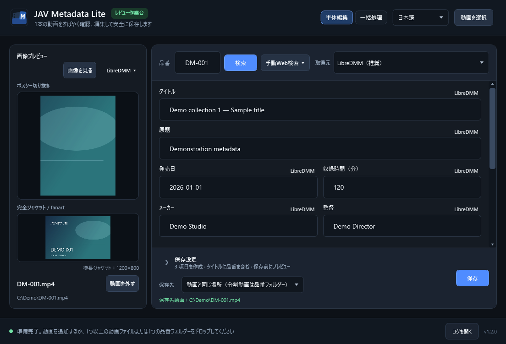

# JavMetaLite

[简体中文](README.zh-Hans.md) · [繁體中文](README.zh-Hant.md) · [English](README.md) · **日本語**

> 現在のバージョン：**1.2.1**。

ローカル動画の情報を確認・整理する Windows アプリです。単体編集と一括処理に対応し、Jellyfin 用のメタデータや画像を出力できます。

画像と情報は合成デモです。[その他の画面](docs/SCREENSHOTS-v1.2.0.md)。

## 主な機能

- 動画の追加やフォルダーのスキャン、CD1/CD2 のグループ化、キューでの一括確認。
- LibreDMM（標準・推奨）、R18.dev、カスタムの複数取得元に対応。JAVLibrary は手動 Web 検索のみ。
- ローカル NFO の編集、画像の取得元とスチル画像の選択、NFO・ポスター・fanart・任意のスチル画像（`extrafanart`）の出力。
- 作品専用フォルダーの `movie.nfo` と画像に対応。単一動画を元のフォルダーに保存する場合は、その命名を維持します。
- ビューアーでの画像比較とローカル画像削除、メイン画面での低解像度ジャケットの注意表示。
- 保存前の変更プレビュー、動画の元の場所への保存または指定フォルダーへの整理。簡体字中国語・繁体字中国語・英語・日本語に対応。

## クイックスタート

Windows 10/11 x64 が必要です。.NET Runtime の別途インストールは不要ですが、内蔵ブラウザーには Microsoft Edge WebView2 Runtime が必要です。

1. [Releases](https://github.com/Noredge/JavMetaLite/releases) の公開済みポータブル ZIP、または案内されたローカル版を取得し、SHA-256 を確認して展開します。
2. `JavMetaLite.exe` を実行し、動画やフォルダーを選択またはドロップします。
3. 品番を確認して検索し、テキスト・画像・保存設定を必要に応じて調整します。
4. 保存ボタンを押して変更プレビューを確認します。一括保存で全動画のプレビューを開く必要はありません。

## 注意点

- 一括検索には LibreDMM を推奨します。R18 はレート制限で遅くなる場合があります。
- 終了後のキュー復元はありません。キューからの削除は動画ファイルを削除しませんが、確認済みのローカル画像削除は即時実行です。
- 重要な動画はバックアップしてください。保存は失敗またはキャンセルで停止します。復元失敗時は復元用フォルダーを保持してください。
- 取得元には成人向けコンテンツが含まれる場合があります。サイトの規約、適用される年齢条件・法令を守ってください。

## 詳細

[リリースノート](docs/RELEASE-NOTES-v1.2.1.md) · [Docs](docs/README.md) · [変更履歴](CHANGELOG.md) · [開発とテスト](TESTING.md)

ビルドには .NET SDK 10.0.400 が必要です。ログと設定は `%LOCALAPPDATA%\JavMetaLite` に保存されます。

[MIT License](LICENSE) · © 2026 Noredge · [サードパーティーについて](THIRD_PARTY_NOTICES.md)。取得元サイトとは提携しておらず、本プロジェクトのライセンスはサイトのデータには適用されません。
