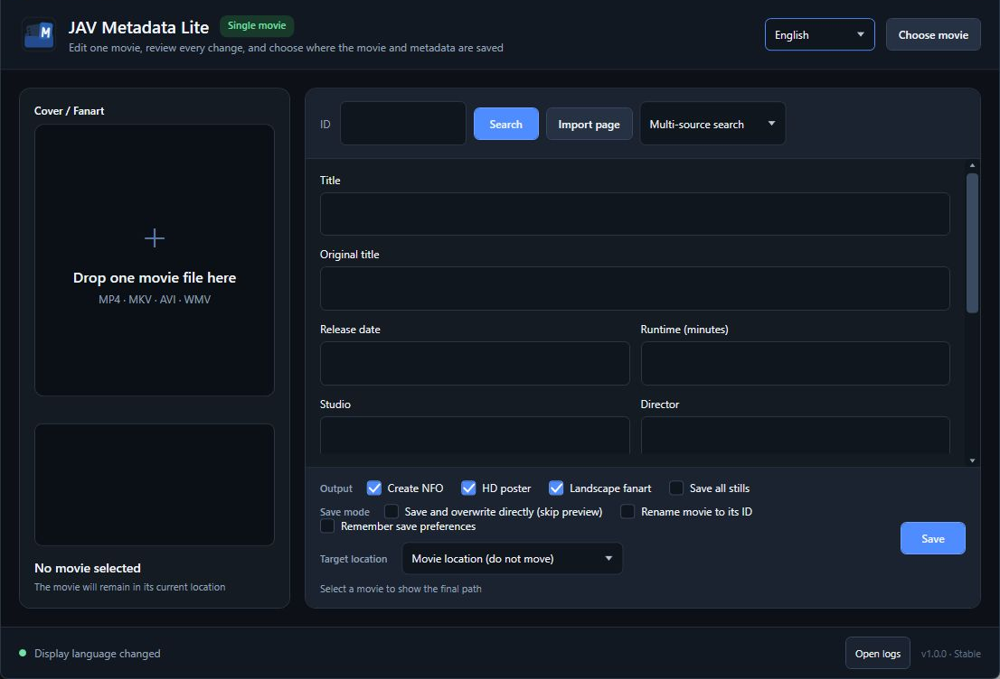

# JavMetaLite


[简体中文](README.zh-Hans.md) · [繁體中文](README.zh-Hant.md) · **English** · [日本語](README.ja.md)

[](https://github.com/Noredge/JavMetaLite/actions/workflows/ci.yml)

JavMetaLite is a lightweight Windows metadata editor that handles one movie at a time. Select or drop a movie, search selected sources, review and edit every field, then preview all file changes before saving. JavMetaLite does not scan a media library or write or move a movie before the user confirms the operation.



## Features

- Handles only the selected movie, with no batch scraping or library scan.
- Uses LibreDMM for Japanese metadata, R18.dev for English metadata, and JAVLibrary as a manual browser fallback.
- Lets the user choose a source for each field after a multi-source search and continue editing manually.
- Reads and safely updates local NFO, poster, and fanart files while preserving unknown XML.
- Produces Jellyfin-compatible NFO, poster, fanart, and optional `extrafanart/` files.
- Keeps the movie in place, creates an ID folder beside it, or organizes it under a custom destination root.
- Uses safe copy and SHA-256 verification for cross-volume or UNC destinations, with rollback on failure.
- Shows the actual file changes before saving by default and always blocks conflicting target movies.
- Ships as a portable, self-contained Windows x64 executable with no .NET Runtime installation required.

## Quick start

1. Download `JavMetaLite-v1.0.0-win-x64-portable.zip` from [GitHub Releases](https://github.com/Noredge/JavMetaLite/releases).
2. Verify the archive against `SHA256SUMS.txt` from the same release, then extract it.
3. Run `JavMetaLite.exe` and choose or drop one movie.
4. Verify the detected ID, search for metadata, and choose suitable text and cover sources.
5. Edit any fields and choose the outputs and destination.
6. Review the save preview and confirm the operation.

Windows may show a SmartScreen warning for the unsigned executable on first launch. Download only from this repository's official releases and verify the SHA-256 checksum.

## Output example

```text
Destination root/
  IPX-123/
    IPX-123.mp4
    IPX-123.nfo
    IPX-123-poster.jpg
    IPX-123-fanart.jpg
    extrafanart/       # optional
      fanart1.jpg
      fanart2.jpg
```

## Metadata sources

| Source | Primary use | Notes |
| --- | --- | --- |
| LibreDMM | Japanese metadata, full cover, sample images | Recommended Japanese source |
| R18.dev | English metadata, full cover, Gallery | English output and supporting source |
| JAVLibrary | Manual browser import | Use when verification is required or automatic sources fail |

Source sites can change or become temporarily unavailable. Multi-source search limits how long each source may wait; switch sources or enter data manually if a source fails instead of restarting the application repeatedly.

## Safety model

- Does not move the movie or directly overwrite metadata by default.
- The preview lists files that will be created, updated, moved, or left unchanged.
- Never overwrites another movie when the target movie already exists.
- Verifies file size and SHA-256 before removing the source during cross-volume transfers.
- Restores overwritten metadata and attempts to preserve the original movie location if a commit fails.
- Searching sends the detected movie ID to the selected metadata sources. Selecting a movie and reading local NFO data does not automatically write anything online or locally.
- Manual JAVLibrary import reads only the current movie page; its embedded WebView2 browser may retain cookies used for site verification.

No file organizer replaces a backup. Back up important media and use a test copy the first time you use a custom destination.

## Requirements and limits

- Windows 10/11 x64.
- On first launch, follows supported Simplified Chinese, Traditional Chinese, English, or Japanese Windows display languages; other system languages fall back to English. Later launches remember the user's selection.
- The embedded browser requires Microsoft Edge WebView2 Runtime, normally already installed on Windows 10/11.
- Supports selecting MP4, MKV, AVI, and WMV movies; does not write metadata inside the media container.
- Does not scan a library, process movies in batches, or automatically move unknown subtitle or companion files.
- Does not currently create `actors/`; actor images are provided through remote `thumb` entries in the NFO.
- Network-share speed, permissions, and availability depend on Windows and the destination server.
- Follow each source site's terms and query only at a reasonable rate.
- Metadata sources may contain adult material. Use the application only where it is legal and appropriate for your age and location.

Logs are stored in `%LOCALAPPDATA%\JavMetaLite\Logs` and kept for 14 days by default. User preferences are stored in `%LOCALAPPDATA%\JavMetaLite\settings.json`.

## Development and testing

.NET 10 SDK is required:

```powershell
dotnet build .\JavMetaLite.App\JavMetaLite.App.csproj
.\scripts\Test-Automated.ps1
```

Create a clean Windows x64 portable package and SHA-256 checksum:

```powershell
.\scripts\New-ReleasePackage.ps1
```

See [TESTING.md](TESTING.md) for the automated test layers and [CHANGELOG.md](CHANGELOG.md) for version history.

## License

JavMetaLite is available under the [MIT License](LICENSE), copyright © 2026 Noredge. Third-party components remain under their respective terms; see [THIRD_PARTY_NOTICES.md](THIRD_PARTY_NOTICES.md).

JavMetaLite is not affiliated with the metadata source sites it reads. The project's MIT License does not relicense data provided by those sites.
