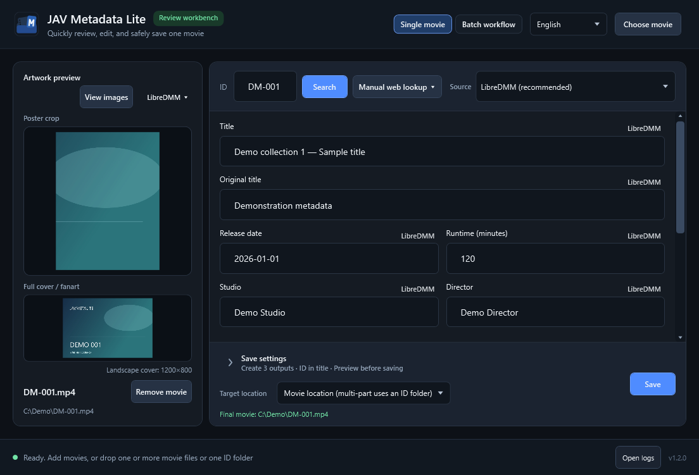

# JavMetaLite

[简体中文](README.zh-Hans.md) · [繁體中文](README.zh-Hant.md) · **English** · [日本語](README.ja.md)

> Current version: **1.2.1**.

A Windows app for reviewing and organizing local movie metadata, individually or in batches, with Jellyfin-compatible output.

Synthetic demo data. [More screenshots](docs/SCREENSHOTS-v1.2.0.md).

## Features

- Add movies or scan folders; group CD1/CD2 parts and review movies in a batch queue.
- Search with LibreDMM (recommended default), R18.dev or custom multi-source rules. JAVLibrary is manual web lookup only.
- Edit local NFO metadata, choose artwork sources and stills, and export NFO, poster, fanart and optional stills (`extrafanart`).
- Read `movie.nfo` and folder-level artwork in dedicated movie folders; retain their names when saving in place.
- Compare and delete local images in the viewer; the main window flags low-resolution covers for review.
- Preview file changes before saving; keep movies in place or organize them into a chosen folder. Four UI languages supported.

## Quick start

Windows 10/11 x64. No separate .NET Runtime installation; the embedded browser requires Microsoft Edge WebView2 Runtime.

1. Get a published portable ZIP from [Releases](https://github.com/Noredge/JavMetaLite/releases), or use the supplied local build. Verify its SHA-256 and extract it.
2. Run `JavMetaLite.exe`, then choose or drop movies/folders.
3. Check IDs, search and adjust metadata, images and save settings as needed.
4. Click Save and review the changes. Batch saving does not require opening every movie's preview.

## Keep in mind

- LibreDMM is recommended for batches. R18 rate limits can slow searches.
- The queue is not restored after closing. Removing queue entries does not delete movie files; confirmed local-image deletion is immediate.
- Back up important media. Saves stop on failure or cancellation; keep recovery folders if restoration fails.
- Sources may contain adult material. Respect their terms and applicable age/legal requirements.

## More

[Release notes](docs/RELEASE-NOTES-v1.2.1.md) · [Docs](docs/README.md) · [Changelog](CHANGELOG.md) · [Development and testing](TESTING.md)

Building requires the .NET SDK 10.0.400. Logs and preferences are under `%LOCALAPPDATA%\JavMetaLite`.

[MIT License](LICENSE) · © 2026 Noredge · [Third-party notices](THIRD_PARTY_NOTICES.md). Not affiliated with source sites; their data is not covered by this project's license.
