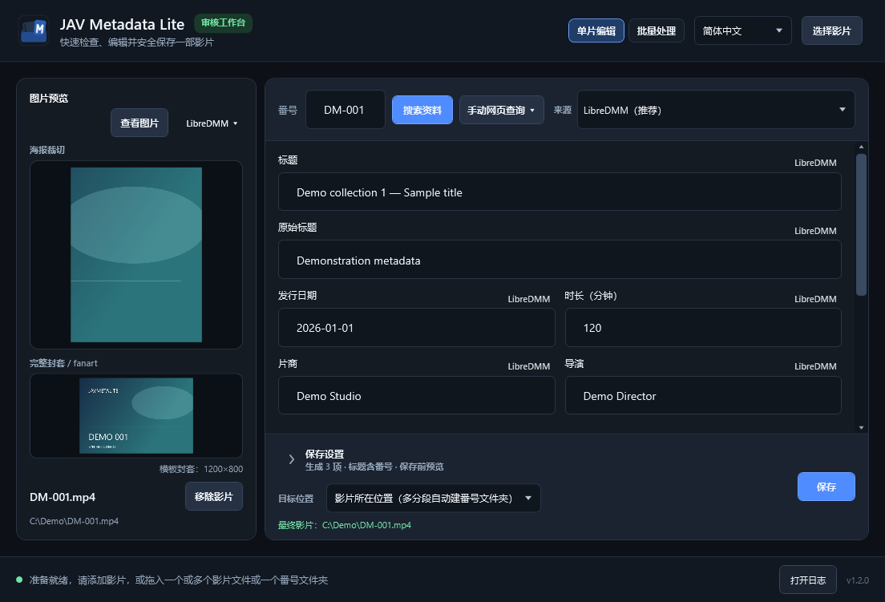

# JavMetaLite

**简体中文** · [繁體中文](README.zh-Hant.md) · [English](README.md) · [日本語](README.ja.md)

> 当前版本：**1.2.1**。

用于本地影片资料审核与整理的 Windows 工具，支持单片编辑、批量处理和 Jellyfin 兼容输出。

图片与资料均为合成演示。[更多截图](docs/SCREENSHOTS-v1.2.0.md)。

## 主要功能

- 添加影片或扫描文件夹，将 CD1/CD2 分组为一部影片，在队列中批量审核。
- 支持 LibreDMM（默认推荐）、R18.dev 和自定义多来源；JAVLibrary 仅用于手动网页查询。
- 编辑本地 NFO、选择图片来源与剧照，生成 NFO、海报、fanart 和可选的剧照（`extrafanart`）。
- 支持独立影片目录的 `movie.nfo` 与目录级图片，普通单片原地保存保留其命名。
- 图片查看器支持比较与本地图片删除，主界面提供低分辨率封套提示。
- 保存前预览文件变更，可保持影片原位或整理到指定文件夹；支持简、繁、英、日四语言。

## 快速开始

需要 Windows 10/11 x64；无需另装 .NET Runtime，内置浏览器需要 Microsoft Edge WebView2 Runtime。

1. 从 [Releases](https://github.com/Noredge/JavMetaLite/releases) 获取已发布的便携包，或使用提供的本地包，核对 SHA-256 后解压。
2. 运行 `JavMetaLite.exe`，选择或拖入影片／文件夹。
3. 检查番号、搜索资料，按需调整文字、图片与保存设置。
4. 点击保存并检查变更预览。批量保存不要求先打开每部影片的预览。

## 必要提醒

- 批量推荐 LibreDMM；R18 可能因限流而较慢。
- 关闭后不会恢复队列。移除队列项目不删除影片；确认删除本地图片会立即执行。
- 请备份重要媒体。保存遇到失败或取消会停止；恢复失败时请保留恢复目录。
- 来源网站可能含成人内容，请遵守其条款及适用的年龄与法律要求。

## 更多

[版本说明](docs/RELEASE-NOTES-v1.2.1.md) · [Docs](docs/README.md) · [更新历史](CHANGELOG.md) · [开发与测试](TESTING.md)

编译需要 .NET SDK 10.0.400。日志和偏好设置位于 `%LOCALAPPDATA%\JavMetaLite`。

[MIT 许可证](LICENSE) · © 2026 Noredge · [第三方声明](THIRD_PARTY_NOTICES.md)。本项目与来源网站无隶属关系，项目许可证不包含网站资料的授权。
