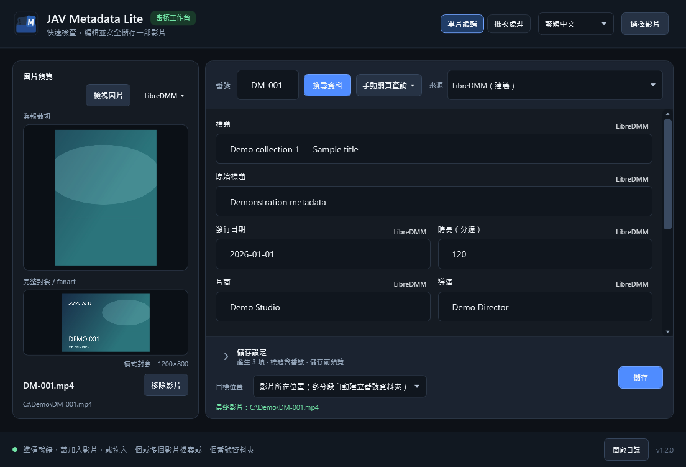

# JavMetaLite

[简体中文](README.zh-Hans.md) · **繁體中文** · [English](README.md) · [日本語](README.ja.md)

> 目前版本：**1.2.1**。

用於本機影片資料審核與整理的 Windows 工具，支援單片編輯、批次處理及 Jellyfin 相容輸出。

圖片與資料皆為合成示範。[更多截圖](docs/SCREENSHOTS-v1.2.0.md)。

## 主要功能

- 加入影片或掃描資料夾，將 CD1/CD2 分組為一部影片，在佇列中批次審核。
- 支援 LibreDMM（預設建議）、R18.dev 與自訂多來源；JAVLibrary 僅供手動網頁查詢。
- 編輯本機 NFO、選擇圖片來源與劇照，產生 NFO、海報、fanart 與選用的劇照（`extrafanart`）。
- 支援獨立影片資料夾的 `movie.nfo` 與資料夾層級圖片，普通單片原地儲存保留其命名。
- 圖片檢視器支援比較與本機圖片刪除，主介面提供低解析度封套提示。
- 儲存前預覽檔案變更，可保持影片原位或整理到指定資料夾；支援簡、繁、英、日四語言。

## 快速開始

需要 Windows 10/11 x64；無需另裝 .NET Runtime，內建瀏覽器需要 Microsoft Edge WebView2 Runtime。

1. 從 [Releases](https://github.com/Noredge/JavMetaLite/releases) 取得已發布的可攜套件，或使用提供的本機套件，核對 SHA-256 後解壓縮。
2. 執行 `JavMetaLite.exe`，選取或拖入影片／資料夾。
3. 檢查番號、搜尋資料，視需要調整文字、圖片與儲存設定。
4. 點選儲存並檢查變更預覽。批次儲存不要求先開啟每部影片的預覽。

## 必要提醒

- 批次建議 LibreDMM；R18 可能因限流而較慢。
- 關閉後不會還原佇列。移除佇列項目不刪除影片；確認刪除本機圖片會立即執行。
- 請備份重要媒體。儲存遇到失敗或取消會停止；復原失敗時請保留復原目錄。
- 來源網站可能含成人內容，請遵守其條款及適用的年齡與法律要求。

## 更多

[版本說明](docs/RELEASE-NOTES-v1.2.1.md) · [交付清單（簡體中文）](docs/RELEASE-v1.2.1.zh-Hans.md) · [更新歷史](CHANGELOG.md) · [開發與測試](TESTING.md)

編譯需要 .NET SDK 10.0.400。記錄與偏好設定位於 `%LOCALAPPDATA%\JavMetaLite`。

[MIT 授權條款](LICENSE) · © 2026 Noredge · [第三方聲明](THIRD_PARTY_NOTICES.md)。本專案與來源網站無隸屬關係，專案授權不包含網站資料的授權。
