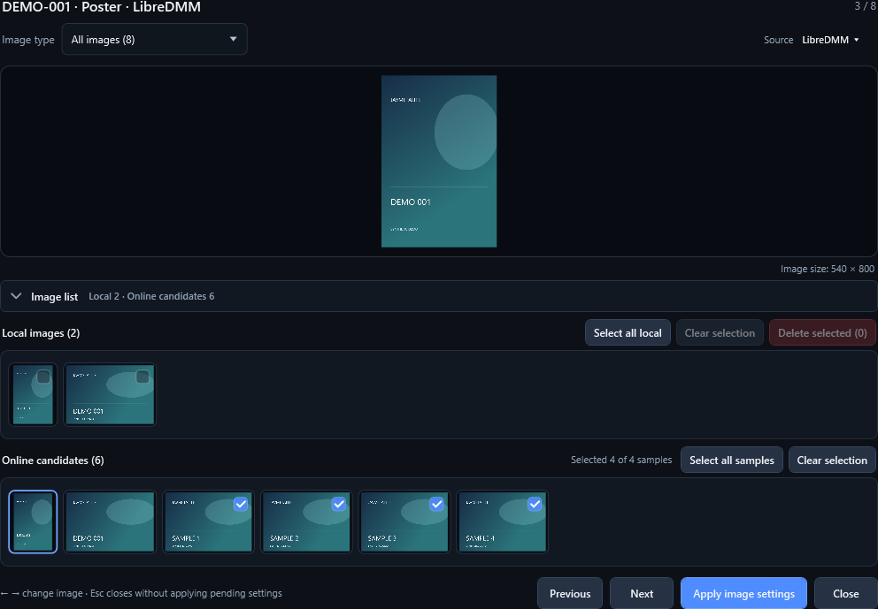

# JavMetaLite v1.2.0-preview.42 发布候选审核稿

> 历史候选材料。当前入口为 [1.2 交付清单](RELEASE-v1.2.0.zh-Hans.md)；下方历史文字、哈希及检查项仅属于 preview.42，不能用于当前定稿。原实拍截图仅保留在本地，本文改用明确标注的 1.2.0 合成示意图。

日期：2026-09-04
状态：历史候选稿，仅供内部参考，禁止据此直接发布。用户已于 2026-09-04 决定暂不对外发布；当前内部修复版本及后续性能门槛见 [preview.43 收尾记录](CLOSEOUT-v1.2.0-preview.43.zh-Hans.md)。

以下 Release 文案、测试结果和哈希均对应 preview.42，不代表后续版本的验证或发布许可。

## 建议的 GitHub Release 标题

`JavMetaLite v1.2.0-preview.42`

## 建议的 GitHub Release 正文

这是 v1.2 的公开预览候选，重点是把 JavMetaLite 从单片 metadata 编辑器扩展为仍以审核和安全为中心的单片／批量工作台。

主要更新：

- 新增独立的单片编辑与批量处理流程。批量模式支持递归扫描、多路径导入、`CD1/CD2` 分组、受控并行搜索，以及统一的保存计划和顺序执行。
- 新增 LibreDMM、R18.dev 与本地 NFO 的逐字段来源审核，并提供自定义多来源规则；图片可按完整封套的真实分辨率选择整套来源，避免海报、Fanart 与在线 Extra Fanart 混用不同来源。
- 完善图片查看器：默认在“全部图片”中保持入口图片及全局序号；顶部“来源”与主界面一致；本地图片和当前在线来源分行显示；来源及在线样张通过“应用图片设置”统一提交。
- 支持查看、选择和管理本地 Extra Fanart，也可在强制深色确认后删除本地海报、Fanart 或 Extra Fanart。“替换本地 Extra Fanart”只有在当前番号实际完成在线搜索并取得样张后才会生效。
- 完善本地 NFO 安全往返、社区评分审核、Jellyfin 可搜索标题、多分段影片旁车命名，以及跨磁盘／UNC 的暂存复制、校验、冲突保护与回滚。
- 统一响应式布局、深色弹窗、折叠区域、像素滚动和必要键盘操作。全局只保留 `Ctrl+S`；番号框内 `Enter` 搜索；队列聚焦时用 `↑/↓` 移动；主窗口 `Esc` 不会取消任务。

这是未签名的 Windows x64 自包含便携包。请解压到新目录，核对同一 Release 内的 `SHA256SUMS.txt`，并先用测试副本验证自定义目标目录或跨磁盘整理。

## 界面示意（当前合成图，非历史实拍）

原 preview.42 实拍包含个人媒体资料，不纳入公开源码。下列图片来自 1.2.0 的合成演示，仅供理解界面，不用于证明 preview.42 当时的布局或验收状态。

### 单片审核工作台

### 图片查看器

截图的合成数据、取景方式与版本边界见 [当前截图说明](SCREENSHOTS-v1.2.0.md)。

## 升级与安全说明

- 建议把新版解压到独立目录，不要直接覆盖正在运行的旧版程序。
- 用户偏好继续保存在 `%LOCALAPPDATA%\JavMetaLite\settings.json`；日志继续位于 `%LOCALAPPDATA%\JavMetaLite\Logs`。
- 影片队列只存在于内存中，关闭程序后不会恢复。
- 默认不会自动保存或自动移动影片；实际写入仍要经过保存验证和保存前预览规则。
- 删除本地图片会在图片查看器中直接执行，但始终要求显式确认，并默认聚焦“取消”。
- 资料来源网站可能变化或暂时不可用；自动来源失败时可切换来源、重试失败来源或手动填写。

## 最终验证记录

验证日期：2026-09-04

- Core smoke tests：35/35 通过。
- File transaction regression tests：29/29 通过。
- WPF UI smoke tests：通过，包含 preview.42 的全局图片定位、来源比较、来源内候选、暂存应用和三个主界面入口。
- 自动化总门槛：`AUTOMATED TEST GATE PASSED`。
- 便携包内文件：4 个。
- `FileVersion`：`1.2.0.0`。
- `ProductVersion`：`1.2.0-preview.42`。
- 包内 `README.txt`：`JavMetaLite v1.2.0-preview.42`。
- 发布临时目录：已清理。

## 待审核资产

| 资产 | 值 |
| --- | --- |
| 便携包 | `JavMetaLite-v1.2.0-preview.42-win-x64-portable.zip` |
| SHA-256 | `6CD272145B7A3F2A00564188D9025336DC3D074A89F943EA20BBED969322DF64` |
| 校验文件 | `SHA256SUMS.txt` |
| 原主界面截图 | preview.42 历史实拍，1120 × 790；仅本地留存，上方展示的是 1.2.0 合成替代图 |
| 原图片查看器截图 | preview.42 历史实拍，1040 × 760；仅本地留存，上方展示的是 1.2.0 合成替代图 |

## 发布检查表

- [x] `CHANGELOG.md` 已覆盖 preview.2–preview.42，并链接本汇总稿。
- [x] 四语言 README 已描述当前主要功能和安全边界。
- [x] 当时已留存最终截图；原历史实拍现仅本地保存，公开材料改用有版本标注的合成图。
- [x] 完整自动化门槛通过。
- [x] 便携包已重新生成并从解压结果核验。
- [x] SHA-256 与 `SHA256SUMS.txt` 一致。
- [ ] 用户审核本发布候选材料。
- [ ] 用户明确授权后再提交发布准备改动。
- [ ] 用户明确授权后再推送、建立标签或创建 GitHub Release。
