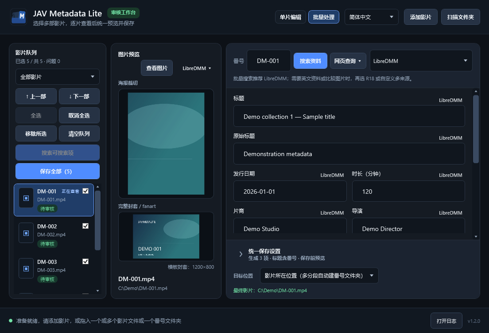
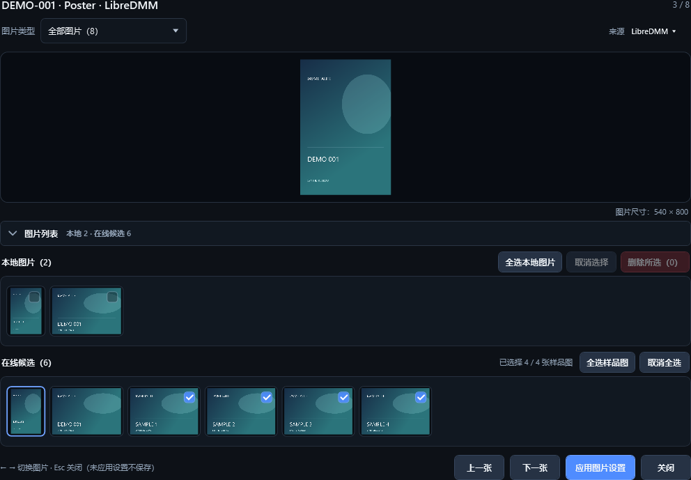

# Screenshots

These screenshots show **1.2.0**, using synthetic titles, artwork and paths. Version 1.2.1 retains the layout but updates some still-image labels.

## Batch workspace

## Artwork viewer

## Other languages

Main workspace: [English](images/javmetalite-v1.2.0-main-single.en.png), [简体中文](images/javmetalite-v1.2.0-main-single.zh-Hans.png), [繁體中文](images/javmetalite-v1.2.0-main-single.zh-Hant.png), [日本語](images/javmetalite-v1.2.0-main-single.ja.png).

These are rendered application controls, not design mockups. They illustrate the interface, not live search results or a guarantee of behavior at every DPI.
